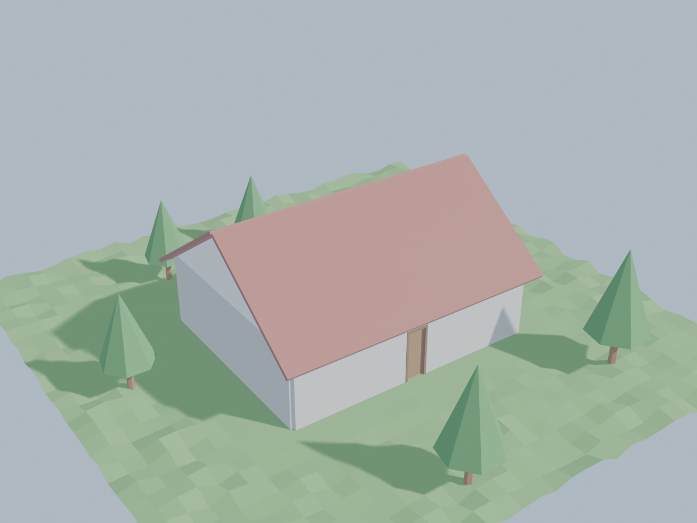
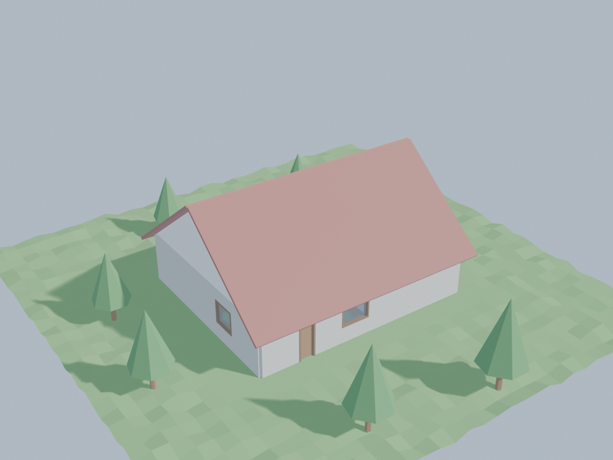

# blender-architecture

> Un constructor procedural de casas para Blender inspirado en la experiencia visual de **Tiny Glade**, pero diseñado desde cero para ser controlable mediante IA, parámetros arquitectónicos y MCP.

## 1. Visión

El objetivo del proyecto es crear una experiencia de construcción de casas donde el usuario pueda:

1. Dibujar o definir una casa de forma visual.
2. Modificarla mediante parámetros.
3. Pedir cambios utilizando lenguaje natural.
4. Generar automáticamente paredes, puertas, ventanas, tejados y elementos decorativos.
5. Obtener una escena visualmente atractiva, con estética de diorama/maqueta.
6. Animar la construcción de los elementos.
7. Mantener una representación paramétrica de la casa para poder modificarla posteriormente.

Ejemplo:

> "Crea una casa de 120 m², con dos plantas, tres dormitorios, un salón orientado al sur y un tejado a dos aguas."

El sistema transforma esa intención en una descripción estructurada y posteriormente en geometría Blender.

---

# 2. Objetivos

## MVP

El primer objetivo NO es construir un clon completo de Tiny Glade.

El MVP debe demostrar únicamente que podemos:

* Crear paredes proceduralmente.
* Crear habitaciones.
* Generar automáticamente puertas y ventanas.
* Generar un tejado.
* Aplicar materiales estilizados.
* Generar terreno básico.
* Colocar vegetación.
* Modificar la casa mediante parámetros.
* Ejecutar las modificaciones mediante Python desde Blender.
* Guardar el estado de la casa en una estructura de datos reproducible.

Resultado esperado:

```text
                 ┌──────────────┐
                 │     TEJADO   │
                 └──────┬───────┘
                        │
             ┌──────────┴──────────┐
             │                     │
             │      CASA           │
             │                     │
             │  ┌──────┐ ┌──────┐ │
             │  │SALÓN │ │COCINA│ │
             │  └──────┘ └──────┘ │
             │                     │
             └─────────────────────┘
                    🌳    🌿
```

---

# 3. Principios de diseño

## 3.1 La casa no será una simple malla

La geometría será una representación visual de un modelo paramétrico.

Ejemplo:

```json
{
  "house": {
    "width": 12,
    "depth": 10,
    "floors": 2
  },
  "rooms": [
    {
      "name": "living_room",
      "width": 6,
      "depth": 5
    }
  ]
}
```

La geometría se podrá regenerar a partir de estos datos.

Esto permitirá modificar:

```text
Casa
  ↓
Parámetros
  ↓
Generador
  ↓
Geometría Blender
```

en lugar de modificar directamente los vértices.

---

# 4. Arquitectura

```text
                    USER
                      │
          ┌───────────┴───────────┐
          │                       │
       GUI Blender             IA / LLM
          │                       │
          │                       ▼
          │                      MCP
          │                       │
          └───────────┬───────────┘
                      ▼
                HOUSE MODEL
                      │
             ┌────────┴────────┐
             │                 │
             ▼                 ▼
        Geometry Nodes       Python
             │                 │
             └────────┬────────┘
                      ▼
                 BLENDER SCENE
                      │
          ┌───────────┼───────────┐
          ▼           ▼           ▼
       Materials   Animation   Environment
          │           │           │
          └───────────┴───────────┘
                      ▼
                 FINAL SCENE
```

---

# 5. Tecnologías

## Core

* Blender
* Python
* Geometry Nodes
* Blender Python API

## IA

* Model Context Protocol (MCP)
* LLM compatible con herramientas MCP

## Opcional posteriormente

* OpenAI API
* Claude
* otros agentes MCP
* generación de texturas
* generación de assets

---

# 6. Estructura del proyecto

```text
ai-glade/
│
├── README.md
│
├── blender/
│   ├── addon/
│   │   ├── __init__.py
│   │   ├── operators.py
│   │   ├── properties.py
│   │   ├── panels.py
│   │   └── scene_manager.py
│   │
│   ├── geometry/
│   │   ├── wall.py
│   │   ├── room.py
│   │   ├── roof.py
│   │   ├── window.py
│   │   └── door.py
│   │
│   ├── materials/
│   │   ├── stone.py
│   │   ├── wood.py
│   │   └── roof.py
│   │
│   ├── environment/
│   │   ├── terrain.py
│   │   ├── vegetation.py
│   │   └── props.py
│   │
│   └── animation/
│       ├── construction.py
│       └── vegetation.py
│
├── mcp/
│   ├── server.py
│   ├── tools/
│   │   ├── house.py
│   │   ├── rooms.py
│   │   ├── walls.py
│   │   ├── roofs.py
│   │   └── environment.py
│   │
│   └── schemas/
│       └── house_schema.json
│
├── assets/
│   ├── vegetation/
│   ├── windows/
│   ├── doors/
│   ├── props/
│   └── materials/
│
├── examples/
│   ├── small_house.json
│   ├── medieval_house.json
│   └── cottage.json
│
└── tests/
    ├── test_house.py
    ├── test_rooms.py
    └── test_geometry.py
```

---

# 7. Fase 0 — Preparación

## Objetivo

Conseguir un entorno reproducible.

### Tareas

* Instalar Blender.
* Crear repositorio Git.
* Crear estructura de carpetas.
* Crear addon mínimo.
* Crear escena de prueba.
* Configurar Python.
* Crear sistema básico de logging.
* Crear primer test.

### Resultado

Blender debe poder ejecutar:

```python
create_house({
    "width": 10,
    "depth": 8
})
```

y producir una casa básica.

---

# 8. Fase 1 — Modelo paramétrico

Esta es probablemente la fase más importante.

Crear un `HouseModel`.

## Entidades

```text
House
 ├── Floor
 │    ├── Room
 │    ├── Wall
 │    ├── Door
 │    └── Window
 │
 ├── Roof
 │
 └── Environment
```

## House

```python
House(
    width,
    depth,
    floors
)
```

## Room

```python
Room(
    name,
    x,
    y,
    width,
    depth,
    floor
)
```

## Wall

```python
Wall(
    start,
    end,
    height,
    thickness
)
```

## Roof

```python
Roof(
    type="gable",
    pitch=35
)
```

---

# 9. Fase 2 — Generador de paredes

Primera pieza visual real.

Entrada:

```python
Wall(
    start=(0, 0),
    end=(6, 0),
    height=3,
    thickness=0.4
)
```

Salida:

```text
████████████████████
████████████████████
████████████████████
```

Pero con estética estilizada:

* piedras individuales
* pequeñas irregularidades
* esquinas suavizadas
* variación de tamaño
* pequeñas imperfecciones

## Importante

No generar cada piedra mediante objetos Blender independientes.

Preferiblemente:

```text
Wall
 ↓
Geometry Nodes
 ↓
Stone distribution
 ↓
Single optimized mesh
```

Esto será fundamental para mantener rendimiento.

---

# 10. Fase 3 — Habitaciones

Implementar:

```python
create_room(
    name="living_room",
    x=0,
    y=0,
    width=6,
    depth=5
)
```

El sistema debe generar automáticamente:

* paredes
* suelo
* conexiones con otras habitaciones

Ejemplo:

```text
┌───────────────┬──────────┐
│               │          │
│     SALÓN     │  COCINA  │
│               │          │
├───────────────┴──────────┤
│                          │
│        DORMITORIO        │
│                          │
└──────────────────────────┘
```

---

# 11. Fase 4 — Puertas y ventanas

Las aperturas deben formar parte del modelo paramétrico.

Ejemplo:

```json
{
  "type": "window",
  "wall": "north_01",
  "position": 0.5,
  "width": 1.4,
  "height": 1.2
}
```

Geometry Nodes debe generar:

* apertura
* marco
* cristal
* persiana opcional

La posición debe mantenerse aunque la pared cambie de tamaño.

---

# 12. Fase 5 — Tejados

Implementar inicialmente únicamente:

### V1

* tejado a dos aguas

### V2

* cuatro aguas
* tejado plano
* torre
* tejados múltiples

Parámetros:

```python
Roof(
    type="gable",
    pitch=35,
    overhang=0.5,
    material="wood_tile"
)
```

---

# 13. Fase 6 — Estética

Aquí comienza la transformación de "modelo Blender" a "Tiny Glade-like".

## Materiales

Crear un pequeño lenguaje visual:

```text
STONE
WOOD
PLASTER
ROOF
GLASS
GROUND
GRASS
```

Cada material tendrá variaciones procedurales.

### Piedra

* diferentes tamaños
* rotación aleatoria
* pequeñas variaciones de color
* juntas visibles

### Madera

* vetas
* irregularidad
* piezas ligeramente diferentes

### Tejados

* tejas individuales o instanciadas
* pequeñas variaciones
* bordes suaves

---

# 14. Fase 7 — Terreno

Crear:

```python
Terrain(
    size=50,
    resolution=64
)
```

Características:

* terreno procedural
* pequeñas elevaciones
* caminos
* zonas de hierba
* piedras
* árboles

El terreno deberá poder modificarse sin destruir la casa.

---

# 15. Fase 8 — Vegetación procedural

La vegetación será principalmente instanciada mediante Geometry Nodes.

Tipos iniciales:

```text
Grass
Flower
Bush
Tree
Rock
Mushroom
```

Reglas:

```text
cerca de agua       → vegetación húmeda

cerca de casa       → hierba baja

zona rocosa         → poca vegetación

bosque              → árboles densos
```

Esto permitirá generar automáticamente escenas que parezcan "vivas".

---

# 16. Fase 9 — Animaciones

No intentar animar cada objeto manualmente.

Crear un sistema de eventos.

```text
BUILD_WALL
BUILD_ROOF
ADD_WINDOW
GROW_TREE
LIGHT_WINDOW
```

Ejemplo:

```python
animate(
    event="BUILD_WALL",
    object=wall,
    duration=1.5
)
```

## Construcción

Secuencia:

```text
cimientos
    ↓
paredes
    ↓
ventanas
    ↓
puertas
    ↓
tejado
    ↓
vegetación
    ↓
decoración
```

Cada elemento debe poder reproducir una animación de construcción.

---

# 17. Fase 10 — MCP

Cuando el generador local funcione, añadir MCP.

No empezar por MCP.

Primero:

```text
Python → Blender
```

Después:

```text
MCP → Python → Blender
```

Esto reduce enormemente la complejidad de depuración.

---

# 18. Herramientas MCP iniciales

El servidor debería exponer herramientas de alto nivel.

## House

```text
create_house
delete_house
get_house
modify_house
```

## Rooms

```text
create_room
delete_room
resize_room
move_room
```

## Walls

```text
create_wall
modify_wall
delete_wall
```

## Openings

```text
add_window
remove_window
add_door
remove_door
```

## Roof

```text
create_roof
modify_roof
```

## Environment

```text
create_terrain
add_tree
add_vegetation
add_path
```

---

# 19. Ejemplo de interacción con IA

Usuario:

> Quiero una casa de campo de 100 m².

IA:

```text
create_house(
    width=10,
    depth=10,
    floors=1
)
```

Usuario:

> Añade un salón grande al sur y dos dormitorios al norte.

IA:

```text
create_room("living_room", ...)
create_room("bedroom_01", ...)
create_room("bedroom_02", ...)
```

Usuario:

> Haz el tejado más inclinado.

IA:

```text
modify_roof(
    pitch=42
)
```

Usuario:

> Pon ventanas grandes en el salón.

IA:

```text
add_window(
    room="living_room",
    size="large",
    count=3
)
```

---

# 20. Fase 11 — Comprensión de lenguaje natural

Una vez que MCP funcione, introducir una capa de interpretación.

No permitir que el LLM genere directamente código Blender arbitrario.

Preferir:

```text
Lenguaje natural
       ↓
Intent
       ↓
Structured command
       ↓
Validation
       ↓
MCP
       ↓
House Model
```

Ejemplo:

```json
{
  "action": "resize_room",
  "room": "living_room",
  "width_delta": 1.5
}
```

Esto permite validar las operaciones antes de modificar la escena.

---

# 21. Fase 12 — Restricciones arquitectónicas

Una vez funcionando el sistema básico, añadir validación.

Ejemplos:

* No permitir habitaciones con dimensiones imposibles.
* Evitar paredes superpuestas.
* Detectar puertas sin acceso.
* Detectar ventanas fuera de paredes.
* Detectar escaleras imposibles.
* Mantener superficies coherentes.
* Mantener conexiones entre habitaciones.

Esto convierte el proyecto progresivamente en una herramienta arquitectónica y no solamente visual.

---

# 22. Fase 13 — UI estilo Tiny Glade

Crear una interfaz sencilla dentro de Blender.

Herramientas:

```text
┌─────────────────────────────┐
│ AI GLADE                    │
├─────────────────────────────┤
│ 🧱 Wall                     │
│ 🚪 Door                     │
│ 🪟 Window                   │
│ 🏠 Room                     │
│ 🏡 Roof                     │
│ 🌳 Vegetation               │
│                             │
│       3D VIEWPORT           │
│                             │
│                             │
└─────────────────────────────┘
```

El objetivo es ocultar progresivamente la complejidad de Blender.

---

# 23. Fase 14 — Sistema de estilos

Separar geometría y estilo.

Ejemplo:

```text
House Model
      │
      ├── Medieval
      ├── Cottage
      ├── Modern
      ├── Scandinavian
      └── Fantasy
```

Una misma casa:

```text
10 × 12 m
```

puede visualizarse con diferentes estilos.

---

# 24. Fase 15 — Rendimiento

Objetivo:

```text
100+ edificios
1000+ árboles
10000+ elementos decorativos
```

sin convertir Blender en una presentación de diapositivas.

Principios:

* Geometry Nodes.
* Instancing.
* Collections.
* LOD.
* Evitar objetos individuales innecesarios.
* Generación bajo demanda.
* Ocultar detalles lejanos.
* Cachear geometría.

---

# 25. Roadmap

## Milestone 1 — Procedural House

* [ ] Addon Blender
* [ ] HouseModel
* [ ] Rooms
* [ ] Walls
* [ ] Roof
* [ ] Windows
* [ ] Doors

## Milestone 2 — Visual Quality

* [ ] Stone
* [ ] Wood
* [ ] Roof tiles
* [ ] Terrain
* [ ] Grass
* [ ] Trees
* [ ] Lighting

## Milestone 3 — Animation

* [ ] Wall construction
* [ ] Roof construction
* [ ] Window construction
* [ ] Vegetation growth
* [ ] Lighting effects

## Milestone 4 — AI

* [ ] MCP server
* [ ] House tools
* [ ] Room tools
* [ ] Wall tools
* [ ] Roof tools
* [ ] Environment tools

## Milestone 5 — Natural Language

* [ ] Intent parser
* [ ] Structured commands
* [ ] Validation
* [ ] Undo/rollback

## Milestone 6 — UX

* [ ] Custom Blender UI
* [ ] Drag & drop walls
* [ ] Visual room creation
* [ ] AI chat panel
* [ ] Style selector

---

# 26. Primer MVP concreto

El primer prototipo debe ser deliberadamente pequeño.

### Input

```python
create_house(
    width=10,
    depth=8,
    height=3,
    roof="gable"
)
```

### Output

Una casa que tenga:

```text
       /────────\
      /          \
     /   ROOF     \
    ┌──────────────┐
    │              │
    │     🪟       │
    │              │
    │  🚪          │
    │              │
    └──────────────┘
```

Con:

* paredes de piedra estilizadas
* tejado procedural
* puerta
* dos ventanas
* suelo
* iluminación
* cámara de diorama

### Segundo paso

Permitir:

```python
resize_house(
    width=12,
    depth=10
)
```

y que **toda la casa se regenere correctamente**.

### Tercer paso

Permitir:

```python
add_room(...)
```

### Cuarto paso

Conectar MCP.

---

# 27. Criterio de éxito del MVP

El MVP será considerado funcional cuando podamos hacer:

> "Crea una casa de 12 × 10 metros con dos habitaciones, salón, cocina, tejado a dos aguas y tres ventanas."

y obtener automáticamente una escena Blender coherente.

Posteriormente:

> "Haz el salón un 20% más grande y mueve la cocina al lado este."

sin tener que volver a modelar manualmente la casa.

---

# 28. Filosofía del proyecto

El objetivo no es hacer:

> **"IA que genera modelos 3D."**

El objetivo es hacer:

> **"Un sistema paramétrico de construcción 3D que una IA puede entender y manipular."**

Esa diferencia es fundamental.

Una IA que genera una malla puede producir algo bonito.

Una IA que entiende:

```text
Casa
 ├── planta
 ├── habitaciones
 ├── paredes
 ├── puertas
 ├── ventanas
 ├── tejado
 └── entorno
```

puede **razonar sobre la casa y modificarla**.

---

# 29. Objetivo final

La experiencia final debería parecerse conceptualmente a:

```text
              ┌───────────────────────┐
              │      AI GLade         │
              │                       │
              │ "Añade una terraza    │
              │  orientada al sur"    │
              └───────────┬───────────┘
                          │
                          ▼
                   ┌─────────────┐
                   │     MCP     │
                   └──────┬──────┘
                          │
                          ▼
                  ┌───────────────┐
                  │ HOUSE MODEL   │
                  └───────┬───────┘
                          │
              ┌───────────┴───────────┐
              ▼                       ▼
       Geometry Nodes             Animation
              │                       │
              └───────────┬───────────┘
                          ▼
                    🏡 WORLD
```

El usuario no debería tener que pensar en vértices, topology, modifiers o nodes.

Debería pensar:

> **"Quiero construir esta casa."**

Y el sistema debería encargarse del resto.

---

# 30. Orden recomendado de implementación

**No intentar desarrollar todas las características simultáneamente.**

Orden estricto:

```text
1. HouseModel
       ↓
2. Walls
       ↓
3. Rooms
       ↓
4. Doors + Windows
       ↓
5. Roof
       ↓
6. Materials
       ↓
7. Terrain
       ↓
8. Vegetation
       ↓
9. Animation
       ↓
10. Python API
       ↓
11. MCP
       ↓
12. Natural Language
       ↓
13. UI
       ↓
14. Architectural constraints
       ↓
15. Performance
```

La prioridad inicial es conseguir **una casa procedural bonita y completamente regenerable**.

Una vez que eso funcione, añadir IA será relativamente sencillo.

---

## Licencia

Inicialmente utilizar una licencia que permita experimentar con el proyecto y cambiarla posteriormente si se decide publicar el sistema.

---

## Estado

**🚧 Alpha — Milestone 1 implementado**

El **Milestone 1 (Procedural House)** ya funciona: modelo paramétrico, rooms,
walls, roof, windows, doors y el addon de Blender.

| Milestone 1 | Estado |
|---|---|
| Addon Blender | ✅ panel N `AI GLADE` + 4 operadores |
| HouseModel | ✅ `blender/model/` (Python puro, sin `bpy`) |
| Rooms | ✅ rectangulares, las paredes se derivan de ellas |
| Walls | ✅ una malla por pared, paredes compartidas deduplicadas |
| Roof | ✅ dos aguas (gable) con pitch + overhang |
| Windows | ✅ hueco booleano + marco + cristal |
| Doors | ✅ hueco booleano + jamba + hoja |

Extras del MVP (§2): terreno plano básico y árboles low-poly instanciados.

**Todavía NO**: MCP (§17 dice explícitamente que va al final), paredes de
piedra con Geometry Nodes, animación, tejados a cuatro aguas.




---

## Getting started

### Requisitos

* Blender **4.2+** (desarrollado y probado con 5.1.0)
* Python 3.9+ en el sistema, solo para los tests del modelo

### Generar una casa desde la línea de comandos

```bash
blender --background --python build_house.py -- examples/small_house.json \
    --out out/small_house.blend --render out/small_house.png
```

Opciones útiles:

```bash
# cambiar el tamaño y regenerar toda la casa (README §26, "segundo paso")
blender --background --python build_house.py -- examples/cottage.json \
    --resize 18 15 --render out/cottage_grande.png

# render rápido con Workbench, sin entorno
blender --background --python build_house.py -- examples/cottage.json \
    --engine WORKBENCH --no-environment --render out/rapido.png
```

### Instalar el addon

`Edit > Preferences > Add-ons > Install…` y selecciona la carpeta
`blender/addon/` (incluye `bl_info` y `blender_manifest.toml`, así que
funciona con el sistema clásico y con las extensiones de 4.2+).

El panel aparece en el viewport 3D, barra lateral `N`, pestaña **AI GLADE**:
ajusta ancho/fondo/plantas/pitch y pulsa **Generate House**. `Load JSON`
permite cargar modelos con varias habitaciones, que el panel por sí solo no
puede describir.

### Tests

Dos suites. La del modelo no necesita Blender:

```bash
python3 -m pytest tests/test_house.py tests/test_rooms.py -v
# 63 passed
```

La de geometría se ejecuta dentro de Blender:

```bash
blender --background --python tests/run_in_blender.py
# 33 passed, 0 failed
```

### Validar un modelo contra el esquema

```bash
pip install check-jsonschema
check-jsonschema --schemafile mcp/schemas/house_schema.json examples/*.json
```

---

## Cómo encaja (Milestone 1)

```text
examples/*.json
      ↓  House.from_dict()  +  House.validate()
HouseModel            ← Python puro, sin bpy, testeable con pytest
      ↓  Floor.walls()      ← las paredes se DERIVAN de las habitaciones
Walls / Openings
      ↓  generate_house()   ← borra la colección y reconstruye (idempotente)
Escena Blender
```

El modelo se guarda como JSON en la propia escena (`scene["aig_house"]`), así
que un `.blend` conserva su descripción paramétrica y se puede regenerar.

### Próximo objetivo

**Milestone 2 — Visual Quality**: piedra y madera procedurales, tejas,
terreno real, hierba e iluminación.
